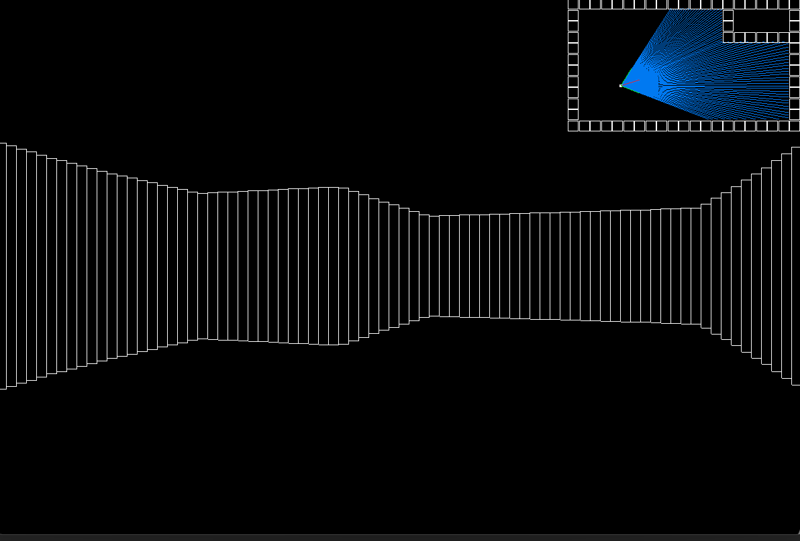

# RaycastEngine

A Raycasting Engine is used to create a pseudo-3D environment. It is based on shooting rays from the player's field of view. 
The engine checks whether the rays intersect with an obstacle, and calculates what to display. It was developed and used for 90s shooter games like Wolfenstein 3D and Doom.

This basic version of a Raycasting Engine correctly calculates how an observer should see the room he is in, more specifically, the walls of the room. 

The engine is written with C++ and Raylib, a library that allows drawing stuff easily on screen. Raylib functions that could have aided in perspective calculation were not used. Only
basic drawing functions were used, such as line drawing. 

 

